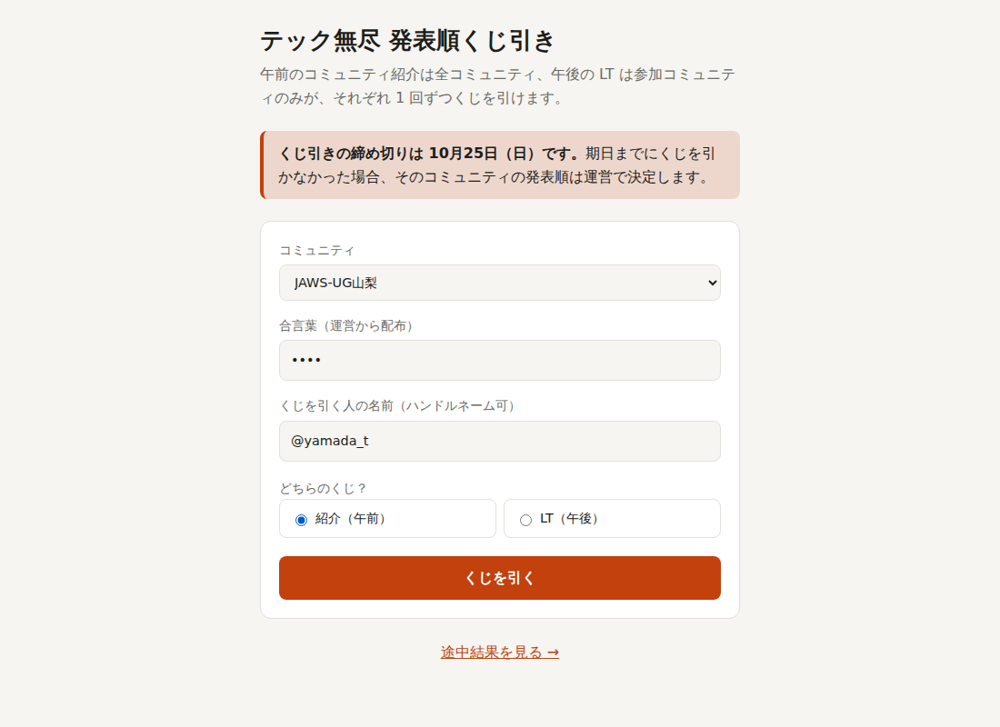
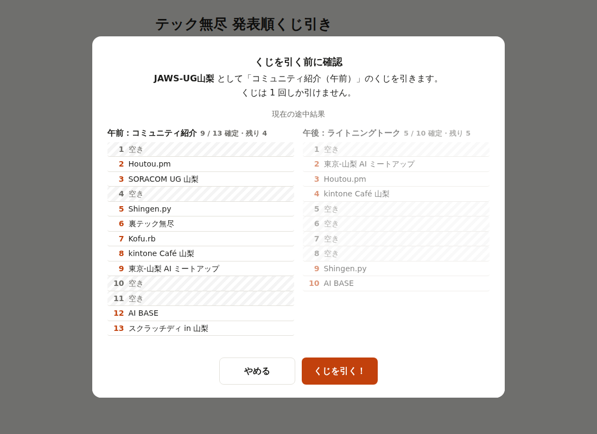
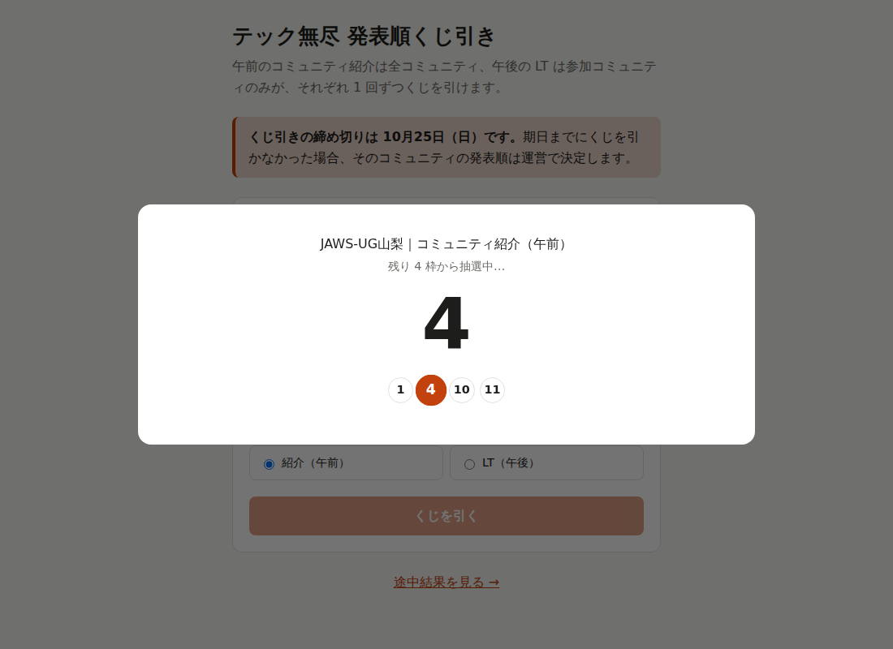
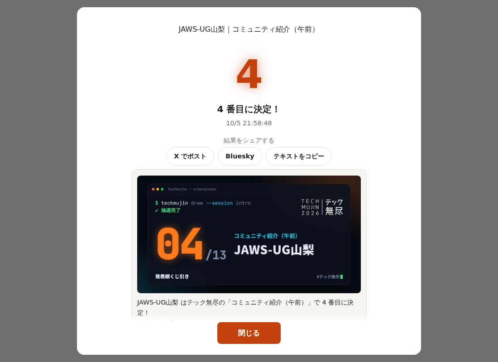
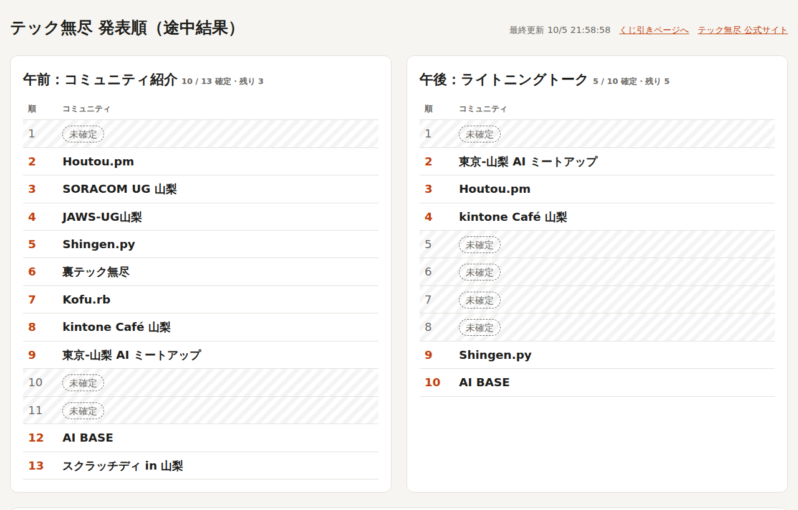
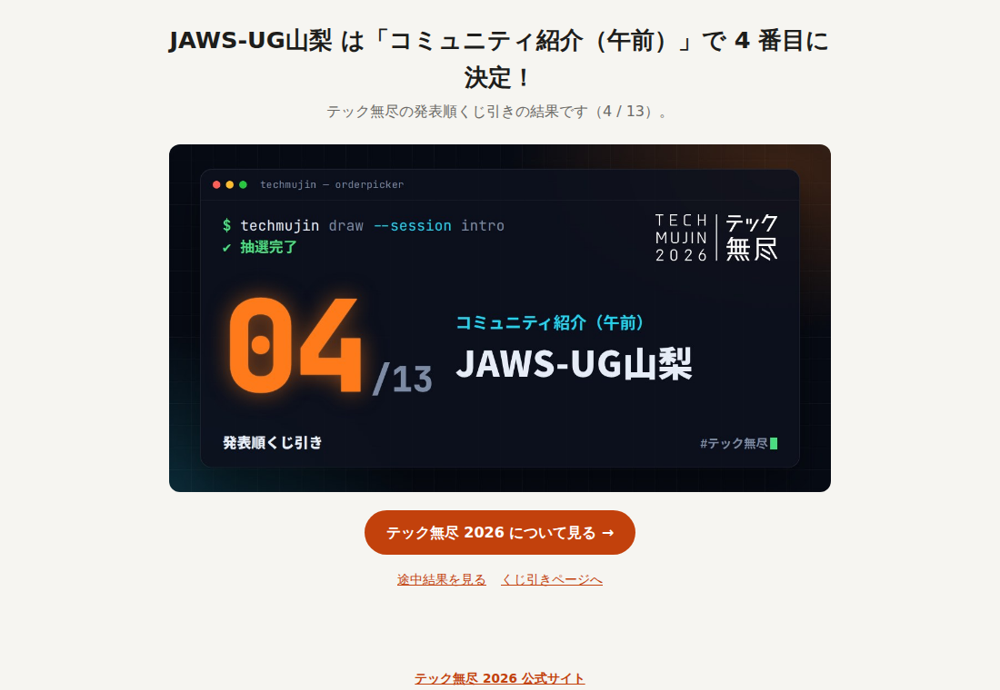
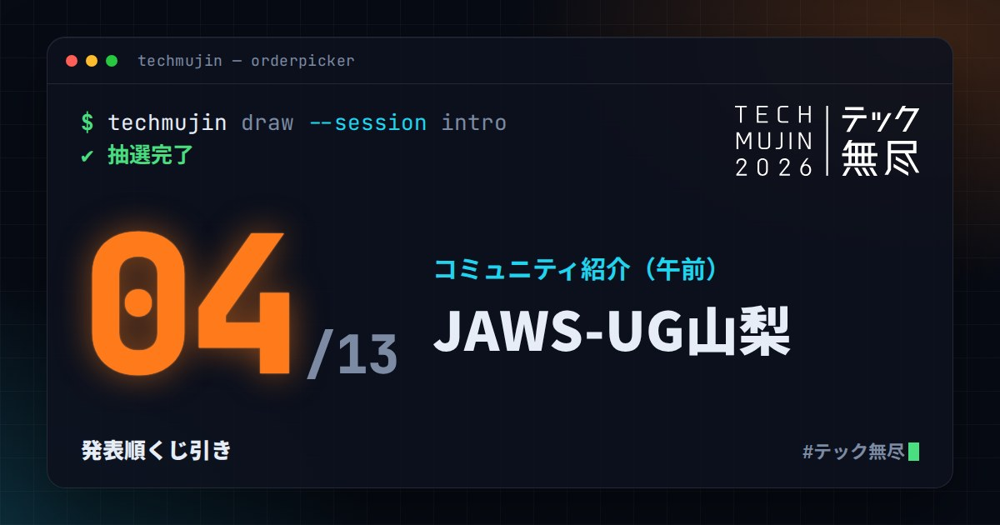
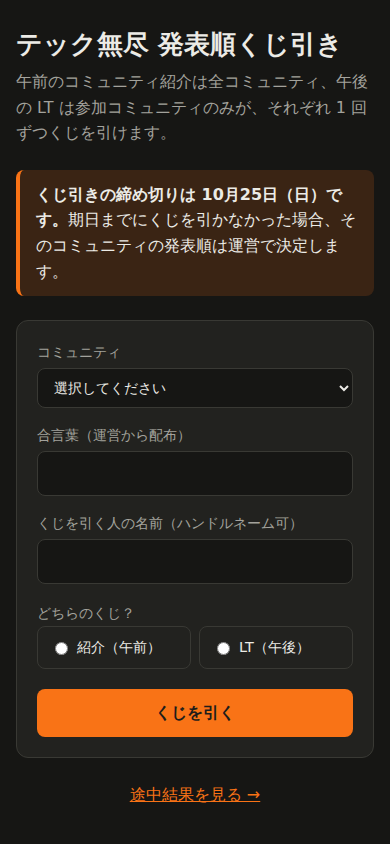

# techmujin-orderpicker

テック無尽の発表順（午前：コミュニティ紹介 / 午後：ライトニングトーク）を決めるくじ引きフォーム。
Cloudflare Workers + D1 + Static Assets で動き、すべて無料枠の範囲で動作します。

## 画面

※ ローカル環境でテスト用の抽選データを入れて撮影したものです。

| くじ引き（トップページ） | 引く前の確認（全体の途中結果つき） |
|---|---|
|  |  |
| **ルーレット演出**（空き枠を照らしながら減速して止まる） | **発表とシェア**（シェア内容のプレビューつき） |
|  |  |

### 途中結果ページ（`/results.html`）

確定した枠はアクセント色、未確定の枠は斜線と点線ラベルで表示します。下にくじ引き履歴（引いた人・日時）があります。



### シェア用ページ（`/s/{session}/{communityId}`）とカード画像

SNS ではカード画像がリンクプレビューとして表示されます。公式サイトへの誘導ボタンつき。

| シェア用ページ | カード画像（`npm run og` で生成） |
|---|---|
|  |  |

### スマホ・ダークモード



## 仕組み

- 各コミュニティに運営が **合言葉（英数字 4 文字）** を配布し、合言葉を知っている人だけがそのコミュニティとしてくじを引ける
- D1 の `UNIQUE(session, community_id)` 制約で **1 コミュニティ 1 セッション 1 回** をサーバー側で保証
  （ブラウザを変えても、同時に押しても 2 回目は 409 で拒否され、既に引いた結果が表示される）
- `UNIQUE(session, slot)` で同じ番号が重複しないことも保証。空き番号から `crypto.getRandomValues` で一様に抽選
- 午後の LT は参加コミュニティ（`communities.json` の `lt: true`）のみが引け、枠数も参加数になる
- 引く前の確認画面と、引いた後の結果画面の両方に、全体の途中結果を表示
- トップページはくじ引きフォームのみのシンプルな構成。全体の結果は `/results.html` で確認する
- `/results.html` は発表順（順番とコミュニティ）と、誰がいつ引いたかの履歴を表示するページ（ページ読み込み時に最新化。プロジェクター投影や URL 共有用）
- 合言葉は DB に SHA-256 ハッシュでのみ保存
- 検索結果には表示しない: `public/robots.txt` で検索エンジンなどのクローラーを拒否し（SNS のリンクプレビュー用ボットは許可）、
  全レスポンスに `X-Robots-Tag: noindex, nofollow`（静的ファイルは `public/_headers`、Worker の応答はコード内）と
  HTML の `<meta name="robots">` を付ける
- くじを引いた後に結果をシェアできる（スマホの共有メニュー / X / Bluesky / テキストコピー）。
  シェア用 URL `/s/{session}/{communityId}` は、実際に引いた結果のカード画像を OGP に設定する

## セットアップ

```sh
npm install
npx wrangler login
npx wrangler d1 create orderpicker   # 表示された database_id を wrangler.jsonc に記入
```

1. `communities.json` に 13 コミュニティの名前と、午後の LT に参加するか（`lt`）を記入
   ```json
   [
     { "name": "コミュニティ A", "lt": true },
     { "name": "コミュニティ K", "lt": false }
   ]
   ```
   午前（コミュニティ紹介）は全コミュニティ、午後（LT）は `lt: true` のコミュニティだけが対象で、
   枠の数もそれぞれの参加数（13 / 10）になる
2. 合言葉を生成: `npm run seed` → `seed.sql` と `codes.csv`（配布用、**コミット禁止**）ができる
3. DB 作成と投入:
   ```sh
   npm run db:migrate:remote
   npm run db:seed:remote
   ```
4. デプロイ: `npm run deploy` → `https://techmujin-orderpicker.<account>.workers.dev`
   （デプロイ前に `npm run og` が自動で走り、シェア用カード画像を `public/og/` に生成する。
   初回はブラウザが必要なので `npx playwright-core install chromium-headless-shell` を実行しておく）
5. `codes.csv` の合言葉を各コミュニティ代表へ個別に連絡

ローカル確認は `db:migrate:local` / `db:seed:local` / `og` のあと `npm run dev`。

## 運用メモ

- 合言葉を再発行する場合は `npm run seed` → `npm run db:seed:remote`（全コミュニティの合言葉が更新され、くじ結果は残る）
- 本番前のテスト結果を消す: `npm run db:reset-draws:remote`
- 特定の結果を取り消す: `npx wrangler d1 execute orderpicker --remote --command "DELETE FROM draws WHERE session='lt' AND community_id=3"`
